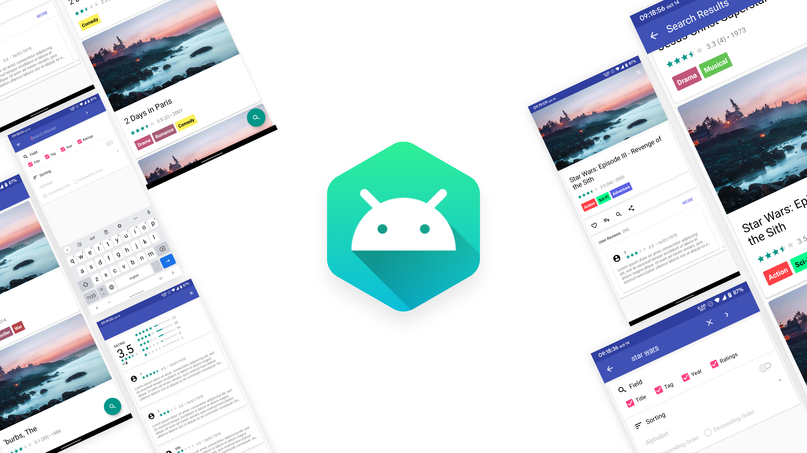

`BONUS COURSE PROJECT`

# MoogleMobile

A GUI implementation of Moogle on Android

## 🚩 Motivations
After the implementation of [Moogle](https://github.com/rektplorer64/ITCS208-P2_Moogle) had completed, students were assigned to create another application that is based on Moogle.
Each student group can choose the approach of their implementation, for instance, they could create a web, an app or a desktop application.
With that freedom, my group decided to work on an Android application development of Moogle in order to experiment and further improve our skills at creating Android app using Java.
Therefore, this project is basically an extended implementation for [Moogle](https://github.com/rektplorer64/ITCS208-P2_Moogle) with a graphic user interface built as an Android Application. 
The app itself at the time has no architectural design in mind in the sense that everything (logic and UI) is contained inside specific Activities. 

## 😀 Features
- [x] ~~Persistent in-app database~~ This is replaced with manual movie information CSV file reads which is not so performant.
- [x] List of movie cards implemented using RecyclerView
- [x] Movie searching and filtering features
    - Filter by Title, Tag, Year and Rating of movies
    - Sort by Movie name, Average score, Year, Total ratings, Total tags
- [x] Rating and comments of each movie is randomized.
- [x] Each movie has tags.
- [x] Activity transition animations are used. 
